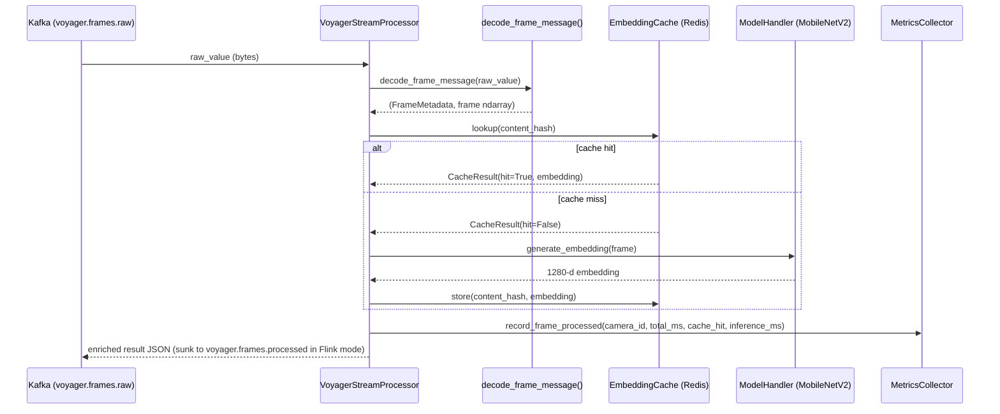
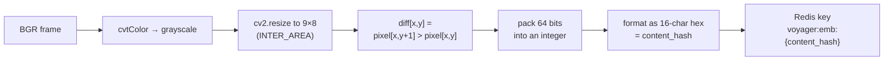
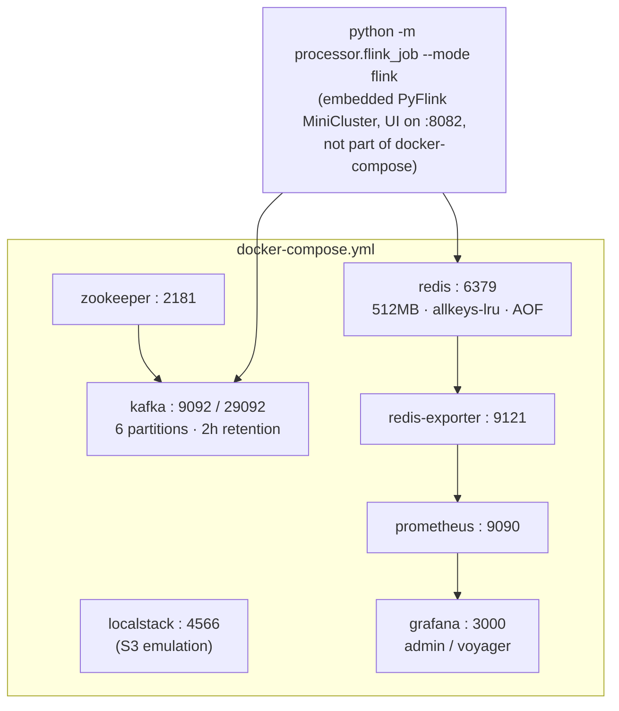

# Voyager — Architecture & Technical Deep Dive

*A source-verified walkthrough of how Voyager actually works: every claim below is
traced to a specific file, function, or config value in this repo. Where the
system's own documentation (`README.md`, `loadtest/scale_design.md`) describes a
target or an aspiration rather than what's running today, that distinction is
called out explicitly rather than blurred.*

---

## What Voyager is

Voyager is a local, fully-runnable simulation of a real-time video ingestion
pipeline: simulated camera feeds publish frames to Kafka, a stream processor
(either PyFlink or a plain Kafka consumer) decodes each frame, checks a Redis
cache before paying for AI inference, runs a MobileNetV2 model on cache misses,
and exposes Prometheus metrics that a bundled Grafana dashboard visualizes.
Every piece of infrastructure it talks to — Kafka, Flink, Redis, S3 (via
LocalStack), Prometheus, Grafana — is defined in [`docker-compose.yml`](../docker-compose.yml)
and runs on a laptop.

## Why it's built this way

The repository documents its own intent directly. [`loadtest/scale_design.md`](../loadtest/scale_design.md)
closes with a section titled **"Interview Talking Points"** — five rehearsed
answers to questions like *"How do you handle 10TB/day?"* and *"How do you keep
latency under 50ms?"*. That framing is the honest one to use here: Voyager is a
systems-design exercise built around the specific mechanics that come up in
distributed-systems interviews — partition-key ordering, exactly-once
checkpointing, cache-driven cost reduction, and back-of-envelope capacity math —
implemented as a real, runnable pipeline rather than left as a whiteboard
sketch. The "Known Gaps" section at the end of this document is written in that
same spirit: precise about what's real versus what's still a design note.

---

## Architecture at a glance

```mermaid
flowchart LR
    subgraph Cameras["producer/ — simulated camera feeds"]
        C1[CameraSimulator thread]
        C2[CameraSimulator thread]
        C3[CameraSimulator thread]
        C4[CameraSimulator thread]
    end

    C1 & C2 & C3 & C4 -->|"JPEG q80 → base64 JSON\nkey = camera_id"| K[("Kafka topic\nvoyager.frames.raw\n6 partitions · LZ4")]

    K --> P{{"processor.flink_job\n--mode flink | --mode standalone"}}
    P -->|"embedded PyFlink\nMiniCluster"| F["VoyagerStreamProcessor\n.process_frame()"]
    P -->|"confluent_kafka\nConsumer"| F

    F --> D["frame_processor\n.decode_frame_message()\ndecode JPEG → grayscale →\ncontent_hash + edge_density"]
    D --> L{"EmbeddingCache.lookup()\nRedis GET voyager:emb:{hash}"}
    L -->|HIT| E1["cached 1280-d embedding\n(< 1ms)"]
    L -->|MISS| M["ModelHandler\n.generate_embedding()\nMobileNetV2, CUDA → MPS → CPU"]
    M --> S["EmbeddingCache.store()\nRedis SETEX, TTL 3600s"]
    S --> E1

    E1 --> R["enriched JSON result\n(metadata + embedding_dim + latency)"]
    R -->|"Flink mode only"| KP[("Kafka topic\nvoyager.frames.processed")]

    F -.->|"metrics recorded\nper frame"| PM["MetricsCollector\n(monitoring/)"]
    PM --> PR["Prometheus\n:8000-8005"]
    PR --> GR["Grafana :3000\n14-panel dashboard"]

    E1 -->|"buffered per camera,\nflushed every 50 frames"| S3H["S3Handler\n.upload_embeddings_batch()"]
    S3H --> S3B[("S3 / LocalStack\nvoyager-logs bucket")]
```



The dashed line into `S3Handler` is deliberate — see [Known Gaps, #2](#2-s3handler-is-fully-built-and-never-called).

---

## The frame lifecycle, precisely

Everything downstream of Kafka funnels through one method:
[`VoyagerStreamProcessor.process_frame`](../processor/flink_job.py) (`processor/flink_job.py:49-106`).
It's the same code path whether it's wrapped in a Flink `MapFunction` or called
directly by the standalone consumer loop — that's the whole point of the class:
one implementation, two runtimes.



Four `time.perf_counter()` checkpoints inside `process_frame` produce the
`latency.decode_ms`, `latency.cache_lookup_ms`, `latency.inference_ms`, and
`latency.total_ms` fields that land in every result and in the Grafana
"Latency & Performance" row.

---

## Component deep dive

### Producer layer (`producer/`)

`kafka_producer.py` defines `create_producer()`, tuned for throughput rather
than per-message latency:

| Setting | Value | Effect |
|---|---|---|
| `linger.ms` | 5 | batches messages for up to 5ms before sending |
| `batch.num.messages` | 100 | target batch size |
| `compression.type` | `lz4` | matches the README's "LZ4 compression" claim |
| `acks` | `1` | leader ack only — no replication wait (there's only 1 broker in dev) |
| `queue.buffering.max.messages` | 100,000 | producer-side buffer cap |

Each `CameraSimulator` (`producer/kafka_producer.py:68-147`) is a daemon thread
that opens a video with OpenCV, loops it (`CAP_PROP_POS_FRAMES, 0` on EOF),
JPEG-encodes each frame at quality 80, base64-encodes it into a `FrameMessage`,
and publishes with **`key=camera_id`** — this is what guarantees per-camera
ordering within a partition, since Kafka only orders messages that share a key.

There are **two separate entry points** that both spin up camera simulators,
and they disagree with each other:

- `kafka_producer.run_multi_camera_producer()` — reads `settings.producer.num_cameras`
  (default 4) and `settings.producer.video_source` from `.env`/`config/settings.py`,
  auto-generating a sample video if the source is missing. This is the one the
  README's Quick Start points at.
- `multi_camera_producer.py` — a second, independent script whose docstring
  says *"Spawns 4 concurrent camera simulators"* but whose code hardcodes a
  list of **6** files (`virat_test_01.mp4` … `virat_test_06.mp4`) at a fixed
  `frame_interval_ms=33` (~30 FPS), ignoring `config/settings.py` entirely.

`sample_video_generator.py` builds a synthetic 30-second MP4 specifically to
exercise the cache: every 20-frame window, frames `0-2` are drawn from a pool
of 5 pre-rendered static backgrounds (`_generate_backgrounds`) while the rest
are procedurally animated (`_render_dynamic_frame`). The recurring backgrounds
are what actually produce cache hits when this video is played through the
pipeline — see the caching section below for why that distinction matters.

### Frame decoding & metadata (`processor/frame_processor.py`)

`decode_frame_message()` (`processor/frame_processor.py:52-86`) parses the Kafka
JSON payload with `orjson`, base64-decodes the JPEG, and runs `cv2.imdecode`.
From the decoded BGR frame it derives:

- **`content_hash`** — a 64-bit difference hash, computed by resizing the
  grayscale frame to 9×8, comparing each pixel to its right-hand neighbor, and
  packing the 64 boolean results into a hex string (`_compute_content_hash`,
  lines 89-98). This is the cache key.
- **`mean_brightness`** — `np.mean` of the grayscale frame.
- **`edge_density`** — fraction of pixels flagged by `cv2.Canny(gray, 50, 150)`,
  used as a scene-activity signal (not currently consumed downstream — it rides
  along in `FrameMetadata` but nothing branches on it today).



### The cache layer — what "perceptual hash caching" actually means here

This is worth being precise about, because the README's phrasing ("perceptual
hash caching") suggests fuzzy, near-duplicate matching, and that's **not**
what's implemented.

`EmbeddingCache` (`processor/cache_handler.py`) does a plain Redis `GET`/`SETEX`
keyed by the **exact** `content_hash` string:

```python
def lookup(self, content_hash: str) -> CacheResult:
    key = f"{self.PREFIX}{content_hash}"
    raw = self._r.get(key)          # exact string match, no distance check
    ...
```

Two frames only collide in the cache if their 9×8-resized difference pattern is
**bit-for-bit identical**. That's exactly right for the synthetic video's
recurring static backgrounds (which really are pixel-identical on repeat), and
it's a legitimate, cheap way to skip inference on truly static scenes — but it
is an *exact-match* cache, not a *similarity-threshold* one.

Separately, `inference/perceptual_hash.py` implements a genuine similarity API:
`dhash()`, `ahash()`, `phash()`, `hamming_distance()`, and `are_similar(threshold=10)`.
It is fully written and unit-testable — and, confirmed by a repo-wide grep, it
is **never imported or called anywhere** in `producer/`, `processor/`,
`inference/`, `loadtest/`, or `tests/`. It's dead code today. Wiring it into
`EmbeddingCache.lookup()` as a fallback (scan a small set of recent hashes for
one within Hamming distance ≤ N before falling back to inference) is the single
change that would make the "perceptual hash caching" description literally
true. See [Known Gaps, #1](#1-perceptual_hashpy-is-fully-built-and-never-used).

### AI inference (`inference/model_handler.py`)

`ModelHandler` lazily loads `torchvision.models.mobilenet_v2` with
`MobileNet_V2_Weights.DEFAULT`, replaces the classifier head with
`torch.nn.Identity()` to expose the 1280-dim feature vector directly, and runs
the standard ImageNet preprocessing (`Resize(256)` → `CenterCrop(224)` →
`Normalize` with ImageNet mean/std). `_select_device()` picks CUDA, then MPS,
then falls back to CPU.

### Metrics (`monitoring/metrics_exporter.py`)

`MetricsCollector` is a thread-safe singleton (`__new__` + a class-level
`threading.Lock`) exposing seven Prometheus series: `voyager_frames_processed_total`,
`voyager_frame_processing_seconds`, `voyager_cache_lookups_total{status}`,
`voyager_inference_duration_seconds`, `voyager_cache_hit_rate`,
`voyager_inferences_skipped_total`, and `voyager_throughput_fps`. Throughput is
computed from a rolling 5-second window of timestamps, rebuilt with a list
comprehension on every single call to `record_frame_processed` — see
[Known Gaps, #10](#10-the-throughput-gauge-recomputes-a-list-on-every-frame).

`start_metrics_server(port)` is called once per Flink subtask, on
`8000 + subtask_index` (`processor/flink_job.py:193`) — which is exactly why
`monitoring/prometheus.yml` scrapes six static targets, `:8000` through `:8005`,
anticipating up to six parallel subtasks even though `FLINK_PARALLELISM`
defaults to 2.

Throughput is computed from a rolling 5-second window of timestamps held in a
`collections.deque`, with expired entries popped from the front on each call —
O(1) amortized per frame (see Known Gaps, #10, for the list-based version this
replaced).

### Storage (`storage/s3_handler.py`)

`S3Handler` auto-creates its two buckets against the LocalStack endpoint on
init, and exposes `upload_model_artifact`, `upload_processing_log`, and
`upload_embeddings_batch` (JSON-lines). `VoyagerStreamProcessor` now calls
`upload_embeddings_batch` — see [The frame lifecycle](#the-frame-lifecycle-precisely)
and [Known Gaps, #2](#2-s3handler-is-fully-built-and-never-called--fixed) for
the wiring and how it was verified against real LocalStack. `upload_model_artifact`
and `upload_processing_log` still have no call site — archiving processed
embeddings was the one that matched the README's "→ S3" arrow.

### Orchestration modes (`processor/flink_job.py`)

`python -m processor.flink_job --mode flink` calls `create_flink_pipeline()`,
which builds a real `KafkaSource → map(FrameMapFunction) → KafkaSink` topology,
configures parallelism and checkpointing from `settings.flink`, sets a 1ms
buffer timeout for low latency, and requires the Kafka connector JAR at
`lib/flink-sql-connector-kafka-4.0.1-2.0.jar` (already committed to the repo).
Critically, it calls `StreamExecutionEnvironment.get_execution_environment(config)`
with no remote target — in PyFlink that spins up an **embedded local
MiniCluster inside the Python process**, not a submission to a remote cluster.
That's why the code hardcodes `rest.port = "8082"`, giving that embedded
MiniCluster's own web UI a fixed port. `docker-compose.yml` no longer runs a
separate Flink cluster (it used to, unused — see
[Known Gaps, #3](#3-the-docker-compose-flink-cluster-is-never-actually-used--removed)),
so 8082 is the only Flink UI in the project now, and it only exists while
`--mode flink` is actually running.

`--mode standalone` calls `run_standalone_consumer()`, a plain
`confluent_kafka.Consumer` loop with no Flink dependency at all — useful for
local development without the JVM, and functionally equivalent per-frame since
both modes call the same `VoyagerStreamProcessor.process_frame`.

---

## Local infrastructure topology



The Grafana dashboard (`monitoring/grafana/dashboard.json`) ships 14 panels
across 4 rows:

| Row | Panels |
|---|---|
| Pipeline Overview | Total Frames Processed, Cache Hit Rate, Inferences Skipped, Throughput (FPS) |
| Latency & Performance | Processing Latency P50/P95/P99, AI Inference Duration |
| Cache Performance | Cache Hit vs Miss Rate, Redis Memory Usage |
| Per-Camera Breakdown | Frames Processed by Camera, Latency by Camera |

---

## Configuration surface

All settings live in `config/settings.py` as Pydantic `BaseSettings`, loaded
from `.env` (gitignored — the repo correctly never commits it).

| Group | Key env vars | Notes |
|---|---|---|
| Kafka | `KAFKA_BOOTSTRAP_SERVERS`, `KAFKA_TOPIC_FRAMES`, `KAFKA_TOPIC_PROCESSED`, `KAFKA_GROUP_ID` | |
| Redis | `REDIS_HOST`, `REDIS_PORT`, `REDIS_EMBEDDING_TTL` (default 3600s) | |
| S3 | `AWS_ENDPOINT_URL`, `S3_BUCKET_ARTIFACTS`, `S3_BUCKET_LOGS` | only read by `S3Handler`, which nothing else calls |
| Flink | `FLINK_PARALLELISM` (default 2), `FLINK_CHECKPOINT_INTERVAL_MS` | |
| Model | `MODEL_NAME`, `EMBEDDING_DIM` (1280) | |
| Producer | `FRAME_INTERVAL_MS`, `VIDEO_SOURCE`, `NUM_SIMULATED_CAMERAS` | ignored by `multi_camera_producer.py` |

`.env` previously also defined `PROMETHEUS_PORT`, `GRAFANA_PORT`, and
`METRICS_EXPORT_PORT` — none had a matching `Field` in `config/settings.py` or
was read anywhere in the codebase; the real ports are hardcoded in
`docker-compose.yml` and `flink_job.py`. All three, plus the unused
`KAFKA_TOPIC_METRICS`, have since been removed.

---

## Testing & verification

| File | Covers |
|---|---|
| `tests/test_processor.py` | `decode_frame_message`, `_compute_content_hash` determinism, `_compute_edge_density` |
| `tests/test_producer.py` | `FrameMessage` construction, `generate_sample_video` output, `CameraSimulator.stop()` |
| `tests/test_load.py` | `_generate_test_frame` determinism, encode/decode roundtrip, `LoadTestResult` construction |
| `tests/test_cache.py` | `EmbeddingCache` lookup/store/flush, hit-rate math, Redis-error handling (mocked Redis client) |
| `tests/test_model_handler.py` | `_select_device` priority (CUDA → MPS → CPU), lazy loading, unknown-model error, one real MobileNetV2 inference |
| `tests/test_metrics.py` | `MetricsCollector` singleton behavior, hit/miss counting, throughput-window eviction, `get_summary` |
| `tests/test_s3_handler.py` | `S3Handler` bucket bootstrap and all three upload methods (mocked `boto3.client`) |
| `tests/test_flink_job.py` | `VoyagerStreamProcessor.process_frame` hit/miss branching and result shape (patched cache/model) |

**Not covered:** `create_flink_pipeline()` itself — the actual PyFlink
`KafkaSource`/`KafkaSink` wiring — since testing it meaningfully needs either a
running Kafka cluster or a much heavier PyFlink test harness.

`loadtest/stress_test.py` is the only place the cache's cost-saving effect is
actually exercised, via `test_cache_hit_simulation()`. Its default parameters
(50 unique frames, then 150 repeats drawn from those same 50) mean every one of
the 150 repeats is guaranteed to hit — the math works out to a **75% hit rate**,
not the README's headline **40%+**. That 40% figure traces to
`loadtest/scale_design.md`'s production-scale assumption, not to a measurement
taken against this repo. See [Known Gaps, #6](#6-the-only-measured-cache-hit-rate-is-75-not-40).

---

## The 10TB/day scaling design — what's real vs. what's a plan

`loadtest/scale_design.md` is an explicit, well-reasoned target architecture:
a 5-broker/3-AZ Kafka cluster with 120 partitions, an 8-node Flink cluster with
RocksDB state and S3 checkpoint storage, a 6-master Redis Cluster with LFU
eviction and cache warming, tiered S3 storage with lifecycle policies, a
4×T4-GPU batched inference pool, and a full DR plan with RPO/RTO targets. None
of this is implemented in code — the running system today is one Kafka broker,
one Redis node, CPU-only MobileNetV2, and no S3 wiring at all. That's
completely normal for a document titled around "Interview Talking Points," but
it's worth stating plainly so the design doc and the running pipeline are never
confused for the same thing.

---

## Known gaps and recommended improvements

Ordered roughly by how much they change what the project actually demonstrates.

#### 1. `perceptual_hash.py` is fully built and never used
`dhash`/`ahash`/`phash`/`hamming_distance`/`are_similar` exist, are individually
correct, and have zero call sites. Wiring `are_similar` into
`EmbeddingCache.lookup()` as a fallback (check a small window of recent hashes
within Hamming distance ≤ N before declaring a miss) would make the marquee
"perceptual hash caching" claim literally true instead of approximately true.
This is the highest-leverage single change available.

#### 2. ~~`S3Handler` is fully built and never called~~ — fixed
`VoyagerStreamProcessor` now buffers each frame's `{content_hash, cache_status,
embedding}` per camera and calls `S3Handler.upload_embeddings_batch()` once a
camera's buffer reaches `EMBEDDINGS_BATCH_SIZE` (50). `S3Handler` construction
and every upload call are wrapped so a failure degrades to "archival disabled"
rather than crashing frame processing — S3/LocalStack remains optional infra,
matching how `EmbeddingCache` already degrades on Redis errors.

Verified for real, not just unit-tested: brought up Kafka + Redis + LocalStack,
produced 60 real frames from one camera, ran them through
`VoyagerStreamProcessor`, then queried LocalStack's S3 directly and confirmed
`s3://voyager-logs/embeddings/CAM-000/.../batch_....jsonl` existed with exactly
50 lines, each a real record with `content_hash`, `cache_status`, and a
1280-dim `embedding`.

That verification surfaced an unrelated, pre-existing bug along the way:
LocalStack's `DATA_DIR: /tmp/localstack/data` combined with a volume mounted at
`/tmp/localstack` made LocalStack try to `rm -rf` its own mount point on every
boot and crash (`OSError: [Errno 16] Device or resource busy`) — meaning the
`localstack` service in `docker-compose.yml` could never actually start,
regardless of this change. Fixed by switching to the modern
`PERSISTENCE: 1` + a volume at `/var/lib/localstack`.

#### 3. ~~The docker-compose Flink cluster is never actually used~~ — removed
`--mode flink` always ran (and still runs) an embedded PyFlink MiniCluster
inside the Python process (hence the distinct `rest.port=8082`); it never
submitted a job to a remote cluster. Rather than build out a real submission
path (packaging the job, `flink run` against a cluster, installing every app
dependency — torch, torchvision, opencv — into the TaskManager image), the
`flink-jobmanager`/`flink-taskmanager` services, the `flink-checkpoints`
volume, and the Prometheus scrape job that pointed at them have all been
removed from `docker-compose.yml` and `monitoring/prometheus.yml`. The
now-equally-dead `FLINK_JOBMANAGER_HOST`/`FLINK_JOBMANAGER_PORT` settings
(never read by any code path) were removed from `FlinkSettings` too.
`--mode flink` is unaffected — it never depended on these containers.

#### 4. ~~`multi_camera_producer.py` duplicates and contradicts `kafka_producer.py`~~ — docstring fixed
Its docstring said 4 cameras; its code hardcodes 6 (`virat_test_01–06.mp4`) at
a fixed 33ms interval, ignoring `config/settings.py` entirely. The docstring
now states this accurately. The duplication and the hardcoded paths are still
there — worth deleting this file in favor of the settings-driven
`run_multi_camera_producer()` if that's ever a priority.

#### 5. ~~Missing test coverage~~ — fixed
Added `tests/test_cache.py`, `tests/test_model_handler.py`,
`tests/test_metrics.py`, `tests/test_s3_handler.py`, and `tests/test_flink_job.py`
(covering `VoyagerStreamProcessor`'s hit/miss branching). Suite went from 15 to
49 tests, all passing — including one real (not mocked) MobileNetV2 inference
in `test_model_handler.py`, since the weights are already cached locally.
`create_flink_pipeline()` itself (the PyFlink wiring) is still untested — it
needs either a running Kafka or a much heavier PyFlink test harness, and
wasn't worth it for this pass. Exercising `s3_handler.py` for the first time
also surfaced a small pre-existing issue: it calls the deprecated
`datetime.utcnow()` in three places — not fixed here, since it was out of
scope for "add tests," but worth a follow-up.

#### 6. ~~The only measured cache hit rate is 75%, not 40%~~ — README reworded
`test_cache_hit_simulation()`'s default parameters mathematically guarantee a
75% hit rate. The README's "40%+" has been reworded to state both numbers and
where each comes from. Running the load test against the real
`virat_test_*.mp4` footage in `data/sample_videos/` to get a realistic measured
number is still open.

#### 7. ~~Two Flink UIs, two ports, no explanation~~ — README clarified
README now states both ports and which Flink instance each belongs to.

#### 8. ~~Dead configuration~~ — fixed
`PROMETHEUS_PORT`, `GRAFANA_PORT`, `METRICS_EXPORT_PORT`, and the leftover
`KAFKA_TOPIC_METRICS` line have all been removed from the local `.env`
(none were read anywhere in the code). `KAFKA_TOPIC_METRICS` was also removed
from `KafkaSettings` itself.

#### 9. ~~No Dockerfile for the application itself~~ — fixed
Added a standalone `Dockerfile` (not wired into `docker-compose.yml`, so the
existing host-based quick start is untouched) covering the producer and
`--mode standalone`. Two things had to be discovered by actually building it,
not just writing it: `python:3.12-slim` needs `build-essential` because
`apache-flink` compiles a Cython extension (`pyflink/fn_execution`) at install
time, and it must follow the exact `setuptools<75` + `--no-build-isolation`
sequence `requirements.txt` already documents for Python 3.12. Verified
end-to-end: built the image, ran it on the `voyager-net` network against the
real `kafka`/`redis` containers with `KAFKA_BOOTSTRAP_SERVERS=kafka:29092` and
`REDIS_HOST=redis`, produced 5 real frames from the host, and watched the
container decode them, download MobileNetV2 weights, run inference, and log
`standalone_consumer_stopped total_processed=5`. `--mode flink` isn't covered
by this image — it additionally needs a JRE, since Flink runs on the JVM.

#### 10. ~~The throughput gauge recomputes a list on every frame~~ — fixed
`MetricsCollector.record_frame_processed` used to rebuild `self._throughput_window`
with a list comprehension on every call — O(n) per frame where n scales with
sustained FPS over the 5-second window. It's now a `collections.deque` with a
timestamp-based `popleft` loop, which is O(1) amortized per frame.

#### 11. ~~`ModelHandler` has no GPU path~~ — fixed
`_select_device()` now picks CUDA, then MPS, then CPU, and the model and
output tensor move accordingly. Verified on this machine: MPS is selected and
used automatically. Still just single-frame inference on one device, not the
scaling doc's batched multi-GPU pool.

#### 12. ~~Minor: unused `import hashlib` in `frame_processor.py`~~ — removed

---

## File map

| Path | Documented in |
|---|---|
| `config/settings.py` | [Configuration surface](#configuration-surface) |
| `producer/kafka_producer.py` | [Producer layer](#producer-layer-producer) |
| `producer/multi_camera_producer.py` | [Producer layer](#producer-layer-producer), [Gap #4](#4-multi_camera_producerpy-duplicates-and-contradicts-kafka_producerpy) |
| `producer/sample_video_generator.py` | [Producer layer](#producer-layer-producer) |
| `processor/frame_processor.py` | [Frame decoding & metadata](#frame-decoding--metadata-processorframe_processorpy) |
| `processor/cache_handler.py` | [The cache layer](#the-cache-layer--what-perceptual-hash-caching-actually-means-here) |
| `processor/flink_job.py` | [The frame lifecycle](#the-frame-lifecycle-precisely), [Orchestration modes](#orchestration-modes-processorflink_jobpy) |
| `inference/model_handler.py` | [AI inference](#ai-inference-inferencemodel_handlerpy) |
| `inference/perceptual_hash.py` | [The cache layer](#the-cache-layer--what-perceptual-hash-caching-actually-means-here), [Gap #1](#1-perceptual_hashpy-is-fully-built-and-never-used) |
| `monitoring/metrics_exporter.py` | [Metrics](#metrics-monitoringmetrics_exporterpy) |
| `storage/s3_handler.py` | [Storage](#storage-storages3_handlerpy), [Gap #2](#2-s3handler-is-fully-built-and-never-called--fixed) |
| `docker-compose.yml` | [Local infrastructure topology](#local-infrastructure-topology) |
| `loadtest/scale_design.md` | [The 10TB/day scaling design](#the-10tbday-scaling-design--whats-real-vs-whats-a-plan) |
| `loadtest/stress_test.py` | [Testing & verification](#testing--verification) |
